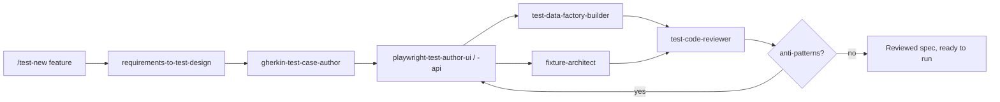
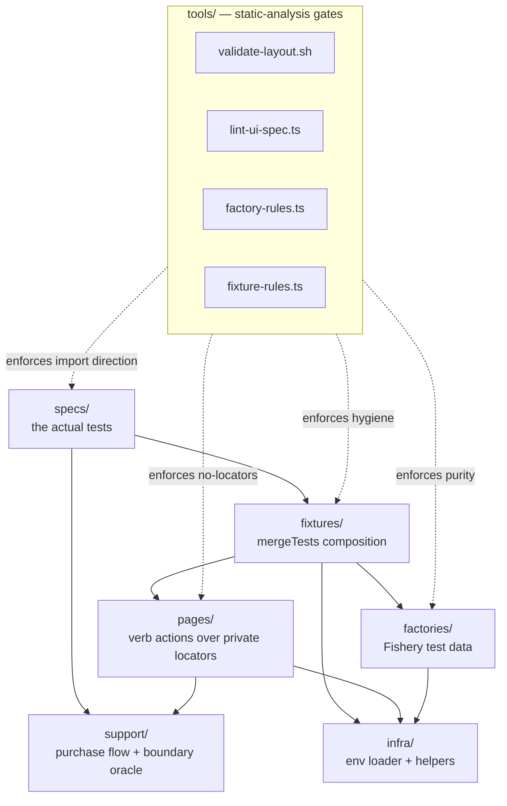

# Free VPN Planet — E2E Test Suite

[](https://github.com/Kseolis/free-vpn-planet-test/actions/workflows/tests.yml)
[](https://nodejs.org/)
[](https://www.typescriptlang.org/)
[](https://playwright.dev/)
[](https://www.conventionalcommits.org/en/v1.0.0/)

## SonarCloud badges

[](https://sonarcloud.io/summary/new_code?id=Kseolis_free-vpn-planet-test)
[](https://sonarcloud.io/summary/new_code?id=Kseolis_free-vpn-planet-test)
[](https://sonarcloud.io/summary/new_code?id=Kseolis_free-vpn-planet-test)
[](https://sonarcloud.io/summary/new_code?id=Kseolis_free-vpn-planet-test)

---

## What this is

This repository delivers the QA test assignment described in [`docs/test-Assignment.pdf`](docs/test-Assignment.pdf): a TypeScript + Playwright black-box E2E test suite that automates three user-facing purchase flows across the **Planet VPN** ecosystem of sites.

| #     | Scenario                    | Entry URL                                                         | Locale |
| ----- | --------------------------- | ----------------------------------------------------------------- | ------ |
| **A** | Sign Up                     | `https://freevpnplanet.com/` → `account.freevpnplanet.com/order/` | EN     |
| **B** | Personal VPN — Russian site | `https://planetconfig.com/`                                       | RU     |
| **C** | Personal VPN — English site | `https://personal.freevpnplanet.com/`                             | EN     |

Every test follows the user journey through plan selection, payment-method choice, and final submission, then **stops at the third-party payment provider page** (Stripe, ЮKassa, etc.). No real card or crypto data is ever entered — see [`docs/CONSTRAINTS.md`](docs/CONSTRAINTS.md) §2.3 for the boundary rule.

The deliverable is graded on **automation craft** (framework design, fixtures, factories, validators, CI) and **analytical findings** (UX/functional defects discovered during automation). UX/functional findings are documented in [`docs/ux-findings.md`](docs/ux-findings.md).

---

## AI-assisted SDET workflow

The single biggest differentiator in this repo is the committed, version-controlled [`.claude/`](.claude/) **AI-assisted SDET kit**. It is not throwaway prompt history — it is a deliberate, reusable engineering asset that turns Claude Code into a disciplined automation pair. Every artefact is checked into git so a reviewer can read exactly how this suite is designed, authored, reviewed, and kept honest.

The kit ships:

- **15 skills** ([`.claude/skills/`](.claude/skills/)) — focused, single-responsibility playbooks: `playwright-framework-bootstrap`, `api-client-from-openapi`, `test-data-factory-builder`, `fixture-architect`, `config-and-secrets`, `requirements-to-test-design`, `gherkin-test-case-author`, `playwright-test-author-ui`, `playwright-test-author-api`, `playwright-debug-conductor`, `test-code-reviewer`, `flaky-triage`, `run-analyzer`, `coverage-gap-analyzer`, `release-report-composer`.
- **3 subagents** ([`.claude/agents/`](.claude/agents/)) — isolated-context workers: `test-design-agent`, `flaky-detective`, `contract-drift-watch`.
- **9 slash commands** ([`.claude/commands/`](.claude/commands/)) — one-shot pipelines: `/test-new`, `/test-fix`, `/test-review`, `/spec-sync`, `/flake-hunt`, `/coverage`, `/release-report`, `/factory`, `/page`.
- **Hooks** ([`.claude/settings.json`](.claude/settings.json)) — guardrails that run mechanically around every agent action:
  - `PreToolUse Bash` → `guard-bash.sh` blocks destructive commands (`rm -rf`, `git push --force`, `sudo`, …).
  - `PreToolUse Edit|Write` → `guard-paths.sh` blocks writes to `tests/api/generated`, snapshots, and `.env` files.
  - `PostToolUse Edit|Write` → `typecheck-touched.sh` **typechecks** touched TS files (formatting + ESLint run separately, via `lint-staged` in the pre-commit hook).
  - `Stop` → echoes a smoke-test reminder so a run never ends silently.

### The `/test-new` pipeline

`/test-new <feature>` chains the skills into a review-gated authoring flow — requirement in, reviewed test out:



The same validators that gate this repo ([`tools/`](tools/)) ship inside the skills as portable templates, so the workflow is reusable in any TypeScript + Playwright project — not bespoke to these three sites. For this black-box project the OpenAPI-oriented skills (`api-client-from-openapi`, `playwright-test-author-api`) and `/spec-sync` are deliberately **disabled** by [`docs/CONSTRAINTS.md`](docs/CONSTRAINTS.md) §4; they remain in the kit to demonstrate contract-testing capability for repos that own a spec.

---

## Why this stack

- **Playwright** for browser automation: trace viewer + video + screenshot artefacts, web-first assertions, parallel workers, native cross-browser (Chromium / Firefox / WebKit).
- **TypeScript (strict)** with `exactOptionalPropertyTypes` and `noUncheckedIndexedAccess` — every page-object and fixture has a precise contract.
- **Fishery + Faker** for deterministic test data (`SEED=1234`) — same data on every run, no surprise flakes from random inputs.
- **Zod** for validating environment variables on import in `tests/infra/env.ts` — fail at boot, never with cryptic runtime errors.
- **ESLint flat config** + **Prettier** + **Husky** + **lint-staged** for pre-commit gates.

What's intentionally **not** used:

- No OpenAPI / contract testing — we test third-party sites we don't own (CONSTRAINTS §2.1). The `openapi-typescript` / `openapi-fetch` / `@redocly/cli` dev-deps stay installed only so the `.claude/` kit's contract-testing skills remain runnable in repos that _do_ own a spec; this project never invokes them.
- No mocking — these are real browser sessions against real production sites.
- No Sentry or telemetry — the SUT is not ours (CONSTRAINTS §2.2).

---

## Architecture

The repo is built around a 6-layer convention pinned in [`tests-config.json`](tests-config.json) and mechanically enforced by validators under [`tools/`](tools/). Imports flow one direction only — reverse imports across layers are forbidden. A deeper walkthrough lives in [`docs/ARCHITECTURE.md`](docs/ARCHITECTURE.md).



### Why layers?

| Layer        | Purpose                                           | Boundary rule                                           |
| ------------ | ------------------------------------------------- | ------------------------------------------------------- |
| `infra/`     | env loader, low-level helpers                     | imported by anything; imports nothing from above        |
| `support/`   | purchase flow + payment-boundary oracle (pure)    | import concrete page objects; contain `expect`          |
| `pages/`     | page objects — verb actions over private locators | no `expect`, no specs imports                           |
| `factories/` | Fishery test-data factories                       | no network, no `Date.now`, no `Math.random`             |
| `fixtures/`  | Playwright fixture composition (`mergeTests`)     | no business logic                                       |
| `specs/`     | the actual tests (AAA structure)                  | no inline locators, no raw `fetch`, no `waitForTimeout` |
| `tools/`     | static-analysis validators                        | run as pre-commit checks and in CI                      |

The validators (`tools/{validate-layout.sh, factory-rules.ts, fixture-rules.ts, lint-ui-spec.ts}`) catch boundary violations at lint time so they don't slip into a PR. See [`tools/README.md`](tools/README.md) for exactly what each one guards.

### Hard rules (mechanically enforced)

- `BasePage` may not import `expect` — assertions belong in specs.
- A `*Page` class must live under `pages/`.
- Specs may not import from `pages/*/locators` — only via the page's public API.
- Specs may not call `page.waitForTimeout` (use web-first assertions / `expect.poll`).
- Specs may not use `axios` or raw `fetch`.
- Factories may not call `Date.now`, `Math.random`, `fetch`, or use top-level mutable state.
- Fixtures must call `await use(...)` — no leaks.
- No hard-coded URLs in `tests/` (except inside `tests/infra/env.ts`).

---

## Project structure

```
.
├── .claude/                      # committed AI-assisted SDET kit (the centerpiece)
│   ├── skills/                   # 15 single-responsibility playbooks
│   ├── agents/                   # 3 subagents
│   ├── commands/                 # 9 slash commands
│   ├── hooks/                    # guard-bash / guard-paths / typecheck-touched
│   └── settings.json             # hook wiring
├── docs/
│   ├── test-Assignment.pdf       # the PRD
│   ├── CONSTRAINTS.md            # authoritative project constraints
│   ├── ARCHITECTURE.md           # layered design + data-flow + gates
│   └── ux-findings.md            # UX & functional defects discovered during automation
├── tests/
│   ├── infra/env.ts              # zod-validated env access
│   ├── support/                  # payment-boundary oracle + shared purchase flow (pure)
│   ├── factories/                # user factory + deterministic seed (_seed.ts)
│   ├── pages/                    # 6 page objects + BasePage (7 files)
│   ├── fixtures/                 # mergeTests of page-object fixtures
│   └── specs/
│       ├── signup/               # Scenario A
│       └── purchase/             # Scenarios B and C
├── tools/                        # this repo's wired-in quality gates
│   ├── validate-layout.sh        # enforce layer rules
│   ├── factory-rules.ts          # enforce factory purity
│   ├── fixture-rules.ts          # enforce fixture hygiene
│   ├── lint-ui-spec.ts           # spec anti-pattern linter
│   ├── verify.sh                 # repo health check
│   └── README.md                 # what each gate guards
├── .github/workflows/tests.yml   # CI: chromium + firefox + webkit matrix + Sonar
├── .husky/                       # pre-commit (lint-staged + validators) + commit-msg
├── playwright.config.ts          # 3 browser projects, retries=2, traces, video
├── tests-config.json             # canonical layer paths and naming
├── tsconfig.json                 # strict TS + path aliases (@pages, @fixtures, ...)
├── eslint.config.mjs             # flat config with playwright + TS rules
├── Makefile                      # one-command entrypoints (make help)
├── CONTRIBUTING.md               # how to add a test + troubleshooting
└── package.json
```

---

## Quick start

```bash
make install        # npm ci + playwright install --with-deps (3 browsers)
make test           # full suite, 3 browsers
make test-smoke     # only @smoke tests
make test-ru        # only RU-locale tests
make test-en        # only EN-locale tests
make test-headed    # visible browser
make test-ui        # interactive UI Mode
make report         # open the last HTML report
make flake-hunt     # rerun the suite 5x to surface flakes
make lint           # eslint + tsc + prettier
make validate       # enforce the layered architecture (layout + factory + fixture + spec gates)
make verify         # repo health check (tooling, files, .claude kit, no leaked secrets)
make help           # all targets with descriptions
```

Without Make, the equivalent `npx playwright test ...` commands are documented in `package.json#scripts`. New contributors: see [`CONTRIBUTING.md`](CONTRIBUTING.md) for how to add a test and a troubleshooting guide.

---

## Test coverage

| Sub-scenario                                                                         | Spec                                              | Browsers                  | Notes                                                                             |
| ------------------------------------------------------------------------------------ | ------------------------------------------------- | ------------------------- | --------------------------------------------------------------------------------- |
| **A** Sign Up — happy path: Home → Log In → Sign Up → 1 year → Credit Card → payment | `tests/specs/signup/signup-flow.spec.ts:8`        | chromium, firefox, webkit | `@smoke`                                                                          |
| **A** terms unchecked blocks payment                                                 | `tests/specs/signup/signup-flow.spec.ts:36`       | chromium, firefox, webkit | negative                                                                          |
| **A** empty email keeps Next disabled                                                | `tests/specs/signup/signup-flow.spec.ts:49`       | chromium, firefox, webkit | negative                                                                          |
| **B** RU 1 month → `card_ru` (Карты Банков РФ)                                       | `tests/specs/purchase/personal-vpn-ru.spec.ts:11` | chromium, firefox, webkit | `@smoke @ru` (parametrised)                                                       |
| **B** RU 1 month → `stripe` (international card)                                     | `tests/specs/purchase/personal-vpn-ru.spec.ts:11` | chromium, firefox, webkit | `@smoke @ru` (parametrised)                                                       |
| **B** RU crypto path                                                                 | `tests/specs/purchase/personal-vpn-ru.spec.ts:35` | n/a                       | `test.fixme` — gateway not exposed on `/payment/`. See `docs/ux-findings.md` B-1. |
| **C** EN `1_month × stripe`                                                          | `tests/specs/purchase/personal-vpn-en.spec.ts:13` | chromium, firefox, webkit | `@en` (parametrised)                                                              |
| **C** EN `1_month × crypto` (BTC)                                                    | `tests/specs/purchase/personal-vpn-en.spec.ts:13` | chromium, firefox, webkit | `@en` (parametrised)                                                              |
| **C** EN `1_year × stripe`                                                           | `tests/specs/purchase/personal-vpn-en.spec.ts:13` | chromium, firefox, webkit | `@en` (parametrised)                                                              |
| **C** EN `1_year × crypto` (BTC)                                                     | `tests/specs/purchase/personal-vpn-en.spec.ts:13` | chromium, firefox, webkit | `@en` (parametrised)                                                              |

> Rows that share a spec line (B → `:20`, C → `:15`) are parametrised — one data-driven `test()` inside a `for` loop, not copy-paste.

---

## Benchmarks (latest local run)

| Metric                      | Value                                                                                        |
| --------------------------- | -------------------------------------------------------------------------------------------- |
| Spec files                  | **3**                                                                                        |
| Test cases                  | **30** (10 unique × 3 browsers)                                                              |
| Lines of TypeScript / shell | **877** (factories + pages + specs + fixtures + support + tools)                             |
| Cross-browser run duration  | **6.8 min** (workers=1, retries=2, video on failure)                                         |
| Pass-rate (after retries)   | **100%** of executed (24 passed + 3 flaky-but-eventually-passed)                             |
| Fixme rate (known gaps)     | **3 / 30 = 10%** (Scenario B crypto, see `docs/ux-findings.md` B-1)                          |
| Flake-rate first-attempt    | **3 / 27 ≈ 11%** (1 SPA-hydration flake on Sign Up, 1 timing flake on RU card_ru in firefox) |
| Validators enforced         | layout + factory + fixture + spec linters; 0 rule violations                                 |

> Benchmark methodology: `make test` against the live production sites at the inspection time (2026-04-28). Numbers reproducible via `make flake-hunt` for stability assessment.

### Running & results — read this before judging a local run

These tests drive **live, third-party production sites** over the public internet; they are inherently flaky (~11% first-attempt flake, documented above, mitigated by `retries: 2`). A local run on your machine may surface flakes from live-site latency or SPA-hydration timing that have nothing to do with the test code.

**CI (GitHub Actions, [`tests.yml`](.github/workflows/tests.yml)) is the authoritative green signal** — it runs the full Chromium/Firefox/WebKit matrix with retries and uploads traces/videos on failure. If you see a local flake, re-run with `make test-headed` / `make test-debug` and consult the [troubleshooting guide in `CONTRIBUTING.md`](CONTRIBUTING.md#troubleshooting) before treating it as a regression. Per [`docs/CONSTRAINTS.md`](docs/CONSTRAINTS.md) §3, a genuine 4xx/5xx is a **finding**, not a flake — surface it, don't silently retry.

---

## Configuration

### `playwright.config.ts`

| Setting             | Value                              | Reason                                                 |
| ------------------- | ---------------------------------- | ------------------------------------------------------ |
| `testDir`           | `tests/specs`                      | enforced by validator                                  |
| `fullyParallel`     | `true`                             | per-file parallelism                                   |
| `retries`           | `2` (always)                       | external sites are inherently flaky — CONSTRAINTS §2.6 |
| `trace`             | `on-first-retry`                   | full trace for the 1st retry                           |
| `screenshot`        | `only-on-failure`                  | reduce noise                                           |
| `video`             | `retain-on-failure`                | keep evidence                                          |
| `actionTimeout`     | `10 000 ms`                        | slow third-party sites                                 |
| `navigationTimeout` | `30 000 ms`                        | external redirects                                     |
| projects            | `chromium`, `firefox`, `webkit`    | cross-browser coverage                                 |
| reporter            | `list` + `html` + `json` + `junit` | dev + CI + analytics                                   |

### `tests/infra/env.ts`

Zod-validated env loader with safe defaults so `make test` runs without an `.env.local`:

```ts
BASE_URL_FREEVPN          default https://freevpnplanet.com/
BASE_URL_ACCOUNT          default https://account.freevpnplanet.com/
BASE_URL_PERSONAL         default https://personal.freevpnplanet.com/
BASE_URL_PLANETCONFIG     default https://planetconfig.com/
SEED                      default 1234         (Faker determinism)
SYNTHETIC_EMAIL_DOMAIN    default yopmail.com  (disposable mail w/ valid MX; CONSTRAINTS §2.4)
CI                        optional             (set by GitHub Actions; gates workers + forbidOnly)
```

Every env var is validated by the zod schema, so a bad value fails fast at import. The factory seed module [`tests/factories/_seed.ts`](tests/factories/_seed.ts) consumes `env.SYNTHETIC_EMAIL_DOMAIN` rather than reading `process.env` directly — honouring the project's "no inline `process.env`" rule. Override it (via `.env.local` or a CI secret) when a target site requires a different disposable-mail domain.

### `tsconfig.json` path aliases

```ts
@pages/*       -> tests/pages/*
@fixtures      -> tests/fixtures/index.ts
@fixtures/*    -> tests/fixtures/*
@factories     -> tests/factories/index.ts
@factories/*   -> tests/factories/*
@infra/*       -> tests/infra/*
```

### CI (`.github/workflows/tests.yml`)

- **Triggers**: push to `main`, pull requests, manual dispatch.
- **Matrix**: `chromium` × `firefox` × `webkit`, `fail-fast: false` so one browser failure doesn't mask the others.
- **Cache**: Playwright browsers cached, scoped per matrix project.
- **Lint + typecheck + validate + format:check**: runs once (on the chromium leg) — the same `tools/` gates that run pre-commit.
- **Artefacts**: HTML report + JUnit + traces/videos uploaded for inspection.
- **SonarCloud**: a separate job waits for the tests, then feeds JUnit results into SonarCloud for the quality gate (badges at the top of this README).
- **CI is the authoritative green signal** — see [Running & results](#running--results--read-this-before-judging-a-local-run).

### Pre-commit (`.husky/pre-commit`)

1. `lint-staged` — Prettier + `eslint --fix` on staged files.
2. `bash tools/validate-layout.sh` — layer-boundary enforcement.
3. `npx tsx tools/lint-ui-spec.ts` — spec anti-pattern scan (hard waits, raw `fetch`, inline page objects, …).

ESLint and Prettier run **only** through `lint-staged` here — they are not part of the post-edit AI hook (which typechecks only). Conventional commit format is enforced by `.husky/commit-msg` (regex on `^(feat|fix|docs|...)(scope)?: subject`). The full `npm run validate` (which adds factory + fixture gates) runs in CI.

---

## Architectural decisions

1. **No single `baseURL`.** The suite spans three different origins, so each Page Object holds an absolute URL derived from `env.BASE_URL_*`. This keeps `goto()` calls explicit and prevents accidental cross-site assumptions.
2. **`PaymentMethodsPage` is origin-aware.** Sites B and C share an identical `<form id="PPG">` on `/payment/` but live at different origins. The page object takes the origin via constructor; the fixture exposes a factory `paymentMethodsPageFor(origin)`.
3. **Programmatic radio/checkbox toggles.** Native `<input type="radio">` and `<input type="checkbox">` on these sites are visually hidden behind custom-styled wrappers and positioned outside the layout viewport. `force: true` on `.check()` is insufficient because the action still requires viewport scroll. Page objects use `evaluate` to set `checked = true` and dispatch `change` — the bulletproof pattern for hidden custom inputs.
4. **`fillEmail` via `evaluate`.** PrimeVue's lazy validator on Site A's `/order/` form gates the **Next** + payment-method buttons until `input` + `change` + `blur` events all fire. Playwright's native `.fill()` doesn't reliably emit `change` in headless mode, so `fillEmail` programmatically dispatches the full event chain. The first dispatch is gated on the plan-select toggle being visible (Vue-hydration marker).
5. **Synthetic-but-real email domain.** `@yopmail.com` is the project default — disposable mail with valid MX records. Sites B and C reject fake-TLD domains (`@example.test`, `@example.com`) by routing the order to `/payment/failed/`, which is itself a UX defect documented in `docs/ux-findings.md` (B-payment-validation).
6. **STOP at the payment page.** Tests assert that the browser has navigated to the third-party provider URL (off-origin or with `gateway=` populated). They never click the final "Pay" button or enter card / crypto data. The `PaymentRedirectPage` is intentionally minimal — only an oracle, no card-form locators.

---

## Findings (assignment requirement)

The full UX and functional defect catalogue is in [`docs/ux-findings.md`](docs/ux-findings.md). Highlights:

- **A-1** Site A email validator accepts strings without `@` (high severity).
- **A-3** `data-test-id="…3_years"` shows the text "4 years" — testId/UX mismatch.
- **B-1** `planetconfig.com /payment/` does not expose a cryptocurrency gateway (the assignment explicitly required crypto coverage).
- **B-payment-validation** RU site routes server-side-rejected emails to a generic "Транзакция отклонена" page after the user has committed to a payment method.
- **C-2** EN site allows clicking **Pay** with crypto selected but no coin chosen — silent no-op.

Plus 6 lower-severity items spanning a11y, autofill compatibility, and design-system divergence between RU/EN.

---

## Limitations

See [`docs/CONSTRAINTS.md`](docs/CONSTRAINTS.md). In particular:

- **Black-box only** — no access to the SUT backend or logs.
- **Tests stop at the payment page.** No real transaction, no card data, no crypto wallet data.
- **External sites** — flakiness is mitigated via `retries: 2` but cannot be eliminated; UX findings about flakiness should be read alongside test results.
- **OpenAPI / contract testing not applicable** — no spec for these sites.

---

## License

Educational / evaluation use only. The test assignment text states the deliverable remains the candidate's intellectual property; this repo follows that. The three sites under test belong to **FREE VPN PLANET S.R.L** and are accessed exclusively for the purpose of demonstrating QA-automation craft.
