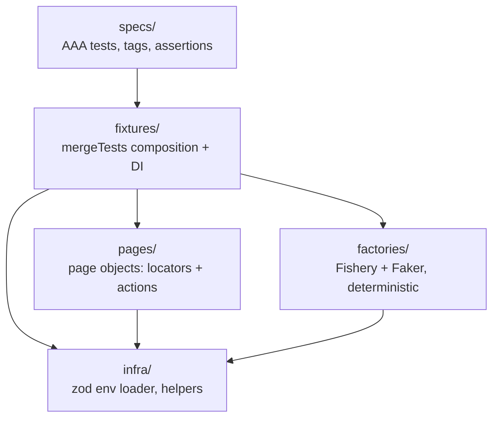
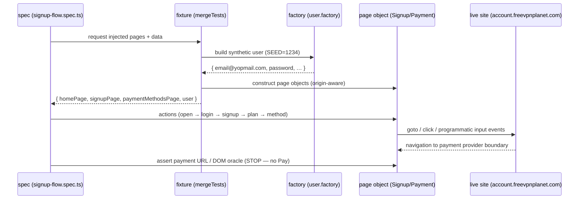
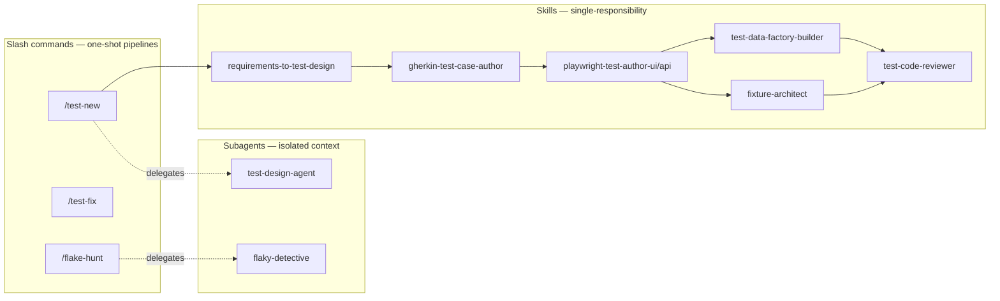

# Architecture

This document explains how the suite is layered, how data flows through a test, which gate enforces which boundary rule, and how the committed [`.claude/`](../.claude/) SDET kit and the [`tools/`](../tools/) validators **mechanically** keep the architecture from eroding.

It is the deep companion to the short contract in [`../CLAUDE.md`](../CLAUDE.md) and the constraints in [`CONSTRAINTS.md`](CONSTRAINTS.md).

---

## 1. The 5 layers

The repository is organised into exactly five layers, pinned in [`../tests-config.json`](../tests-config.json). Imports flow in **one direction only**; a reverse import (e.g. a page object importing a spec) is a build failure, not a code-review nit.

| Layer        | Path              | Responsibility                                       | Must not                                                         |
| ------------ | ----------------- | ---------------------------------------------------- | ---------------------------------------------------------------- |
| `infra/`     | `tests/infra`     | zod-validated env access, cross-cutting helpers      | import from any layer above                                      |
| `pages/`     | `tests/pages`     | locator builders + user actions (`BasePage` + 7 POs) | contain `expect`; import specs                                   |
| `factories/` | `tests/factories` | type-safe synthetic data via Fishery + Faker         | touch the network, `Date.now`, `Math.random`, top-level mutables |
| `fixtures/`  | `tests/fixtures`  | compose page objects + factories into injected deps  | hold business logic                                              |
| `specs/`     | `tests/specs`     | the actual tests — Arrange / Act / Assert            | inline locators, raw `fetch`/`axios`, `waitForTimeout`           |

There is **no** `components/`, `api/`, `clients/`, `generated/`, or `data/` layer. Those were removed during the reorganization; this project is black-box UI E2E with no API contract under our control (see [`CONSTRAINTS.md`](CONSTRAINTS.md) §2.1).

---

## 2. Data flow through one test

A representative happy-path spec (Scenario A — Sign Up) flows like this:

Key invariants visible above:

- **No `baseURL`.** Three origins are in play, so each page object carries an absolute URL derived from `env.BASE_URL_*`. `goto()` is always explicit.
- **Determinism.** All synthetic data comes from Faker seeded once in [`../tests/factories/_seed.ts`](../tests/factories/_seed.ts) (`SEED=1234`), so the same email/password is produced every run.
- **The payment boundary is a hard stop.** Specs assert the provider page is reached and never submit card/crypto data ([`CONSTRAINTS.md`](CONSTRAINTS.md) §2.3). `PaymentRedirectPage` is an oracle only — it deliberately has no card-form locators.

---

## 3. Boundary rules → which gate enforces them

The rules are not aspirational. Each is enforced by a script under [`../tools/`](../tools/), wired into `npm run validate`, `.husky/pre-commit`, and CI. Exit code `0` = pass; non-zero fails the build.

| Boundary rule                                                                                  | Enforced by                | Where it runs                      |
| ---------------------------------------------------------------------------------------------- | -------------------------- | ---------------------------------- |
| Specs don't import locators directly; `*Page` classes live only under `tests/pages/`           | `tools/validate-layout.sh` | `npm run validate`, pre-commit, CI |
| `BasePage` contains no `expect`; no raw `axios`/`fetch` in specs                               | `tools/validate-layout.sh` | `npm run validate`, pre-commit, CI |
| No `waitForTimeout`, no XPath, no inline page-object construction, no stray `console.log`      | `tools/lint-ui-spec.ts`    | `npm run validate`, pre-commit, CI |
| Factories stay pure: no network, no `Date.now`/`Math.random`, no top-level mutable state       | `tools/factory-rules.ts`   | `npm run validate`, CI             |
| Every fixture calls `await use(...)`; no built-in name collisions; scope sanity                | `tools/fixture-rules.ts`   | `npm run validate`, CI             |
| Repo health: tooling present, required files exist, `.claude/` kit intact, no `.env` committed | `tools/verify.sh`          | `npm run verify`                   |

All scripts read their paths from [`../tests-config.json`](../tests-config.json), so a layout change in one place propagates to every gate. See [`../tools/README.md`](../tools/README.md) for the full table.

---

## 4. The `.claude/` kit and how it enforces the architecture

The kit is a committed, reusable engineering asset, not prompt history. It has three composable tiers plus a guardrail layer.

- **Skills** ([`.claude/skills/`](../.claude/skills/)) are the building blocks — each does one thing (design, author, review, analyze).
- **Subagents** ([`.claude/agents/`](../.claude/agents/)) run a skill in an isolated context so a long design or flake hunt doesn't pollute the main conversation.
- **Slash commands** ([`.claude/commands/`](../.claude/commands/)) chain skills/agents into repeatable pipelines (`/test-new`, `/test-fix`, …).

### Mechanical enforcement: hooks + validators

Two independent mechanisms keep the architecture honest regardless of who (human or agent) makes a change:

1. **Claude Code hooks** ([`.claude/settings.json`](../.claude/settings.json)) — guard the _agent's_ actions in real time:
   - `PreToolUse Bash` → `guard-bash.sh` blocks destructive shell commands.
   - `PreToolUse Edit|Write` → `guard-paths.sh` blocks writes to `tests/api/generated`, snapshots, and `.env`.
   - `PostToolUse Edit|Write` → `typecheck-touched.sh` typechecks touched files immediately (formatting/lint are handled later, by `lint-staged`).
   - `Stop` → echoes a smoke-test reminder.
2. **Git-level validators** ([`../tools/`](../tools/)) — guard _every_ commit, agent-authored or not, via `.husky/pre-commit` and CI.

The skills carry portable copies of the same validators (e.g. `.claude/skills/playwright-test-author-ui/scripts/lint-ui-spec.ts`); the copies in `tools/` are this repository's wired-in, active gates. The kit is the template; `tools/` is the running instance.

### Disabled-by-constraint

For this black-box project, [`CONSTRAINTS.md`](CONSTRAINTS.md) §4 disables the OpenAPI-oriented capabilities (`api-client-from-openapi`, `playwright-test-author-api`, `/spec-sync`, `contract-drift-watch`). They remain committed to demonstrate that the workflow _supports_ contract testing when a repo owns a spec — they are simply switched off here.
